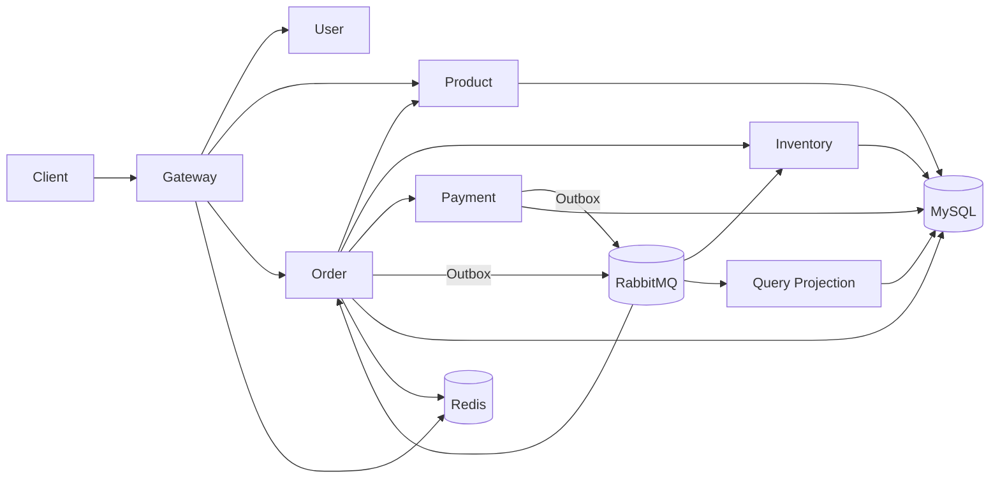

# Mall Order System — 企业级分布式订单系统

围绕订单主链路构建的企业级 Java 订单系统，重点处理防超卖、支付与关单竞争、消息最终一致性、幂等、补偿、分片路由、CQRS 查询和可观测性。系统不把 Redis 当作普通库存事实源，也不使用跨服务大事务。

## 当前已实现能力

- 20 个 Maven 模块，Java 17、Spring Boot 3.5.7、Spring Cloud 2025.0.0。
- Gateway 统一路由、TraceId、按用户/IP 的 Redis 令牌桶限流。
- 商品查询、订单结算/创建/查询/取消/支付/发货/收货、Mock 支付、库存预占/确认/释放。
- MySQL 条件更新防超卖，订单状态与版本条件更新处理支付/关单竞争。
- 业务表 + Outbox 同事务、RabbitMQ 至少一次发布、消费日志唯一键与业务状态双层幂等。
- 超时订单关闭、过期库存预占释放、立即补偿和对账异常记录。
- MySQL CQRS 投影、订单路由表、ShardingSphere 2 库 × 8 表接入配置。
- Redis Lua 秒杀预扣实验入口、k6 脚本、Actuator、Prometheus 与 Grafana。
- 状态机、支付回调并发幂等和 100 并发抢 10 库存测试。

说明：默认运行模式为单库；Nacos、Sentinel、ShardingSphere 已提供接入位置和配置设计，其中 ShardingSphere 需在建立物理分片表并加入运行依赖后启用。仓库没有虚构性能数据。

## 架构与业务流程



核心链路：重新报价 → MySQL 原子预占库存 → 订单/明细/状态日志/Outbox 本地事务 → 创建支付单 → 幂等支付回调与支付 Outbox → 订单状态机推进 → 订单 Outbox → 库存确认 → CQRS 投影更新。

## 服务说明

| 服务 | 端口 | 职责 |
|---|---:|---|
| order-gateway | 8080 | 路由、TraceId、用户/IP 限流 |
| order-user-service | 8081 | 登录、JWT、当前用户 |
| order-product-service | 8082 | SPU/SKU、价格和商品快照来源 |
| order-inventory-service | 8083 | 库存预占、确认、释放、流水与补偿 |
| order-order-service | 8084 | 结算、订单编排、状态机、Outbox、超时关闭 |
| order-payment-service | 8085 | 支付单、Mock 渠道、回调幂等、支付事件 |
| order-query-service | 8086 | 运营侧 CQRS 查询投影 |

基础设施为 MySQL 8.4、Redis 7.4、RabbitMQ 4.1、Nacos 2.4、Prometheus 3.5 和 Grafana 12.1。中间件版本可按部署环境升级，但应先验证兼容性。

## 数据与状态机

金额使用分为单位的 `BIGINT`。库存满足：

```text
total_stock = available_stock + reserved_stock + sold_stock
```

预占 SQL 仅在 `available_stock >= quantity` 时扣减；确认和释放仅处理 `RESERVED` 记录。订单状态机为：

```text
WAIT_PAY -> WAIT_DELIVERY -> WAIT_RECEIVE -> COMPLETED
    └──────────────────────────────> CANCELED
```

支付状态独立为 UNPAID/PAID。支付成功与超时关单都使用 `WHERE status = WAIT_PAY AND version = ?`，受影响行数必须为 1。

## RabbitMQ、Outbox 与幂等

`order.domain.exchange` 是 topic exchange。主要事件：`payment.succeeded`、`order.created`、`order.paid`、`order.canceled`。服务本地事务只提交业务表和 Outbox；发布器独立投递并记录成功或退避重试。消费者事务先插入 `(consumer_group,event_id)`，唯一键冲突即视为已经消费，同时库存和订单仍用状态条件保证业务幂等。

超时关闭采用数据库定时扫描兜底；RabbitMQ 延迟队列可在部署时增加，以提升及时性。支付成功晚于订单关闭会进入 `reconciliation_exception`，而不是静默忽略。

## 分库分表与 CQRS

生产型分片方案为 `user_id % 2` 分库、`order_id % 8` 分表；用户订单查询限定在单库但需多表归并。`order_route` 保存 orderNo 到 userId/orderId/分片的映射，运营查询通过 RabbitMQ 更新 `order_query_projection`，避免长期扫描全部分片。配置样例见 `config/sharding/application-sharding.yml`。

## 启动

要求：JDK 17、Maven 3.9+、Docker Compose。

```bash
cd docker
docker compose up -d
cd ..
mvn clean test
```

基础设施健康后，在 IDEA 依次启动 Product、Inventory、Order、Payment、Query、User，最后启动 Gateway。默认数据库账号为 `order/order123456`，只适用于本地环境；生产必须改密并启用 TLS、Nacos 鉴权和密钥管理。

## 接口示例

登录演示账号为 `demo/demo123`。主链路也可直接用开发 Header：

```bash
curl -X POST http://localhost:8080/api/orders/settlement -H "Content-Type: application/json" -d '{"items":[{"skuId":10001,"quantity":1}]}'

curl -X POST http://localhost:8080/api/orders -H "Content-Type: application/json" -H "X-User-Id: 10001" -H "X-Idempotency-Token: order-001" -d '{"items":[{"skuId":10001,"quantity":1}]}'

curl -X POST http://localhost:8080/api/orders/{orderNo}/pay -H "X-User-Id: 10001"

curl -X POST http://localhost:8080/api/payments/{payOrderNo}/mock-success -H "X-Notify-Id: notify-001"

curl http://localhost:8080/api/orders/{orderNo} -H "X-User-Id: 10001"
```

同一个 `X-Notify-Id` 重复回调不会产生第二次业务效果。用户订单查询始终带 userId，避免仅凭 orderNo 越权。

## 测试、压测与故障注入

`mvn clean test` 执行单元及并发测试。k6：

```bash
k6 run -e RATE=20 -e DURATION=60s -e BASE_URL=http://localhost:8080 scripts/k6-order.js
```

实际结果应记录在 `docs/pressure-test.md`，包含硬件、中间件拓扑、数据规模、QPS、P95/P99、错误率、CPU、内存、连接池和 MQ backlog。

故障开关前缀为 `debug.failure`，预留库存成功后失败、订单提交前失败、MQ 发布失败、支付通知失败。演练后检查 Outbox、预占补偿、消费日志、DLQ 和对账异常表。

## 可观测性

所有 HTTP 响应携带 `X-Trace-Id`；Actuator 暴露 health/info/prometheus。Prometheus 采集 8080–8086，Grafana 预置 HTTP RPS、P95、JVM 内存和数据库连接池面板。业务指标入口位于 `common-observability`，生产部署应补充 Outbox backlog、DLQ、库存失败率及支付成功率告警。

## 设计资料

- `docs/architecture.md`：架构与边界
- `docs/database.md`：数据库约束
- `docs/rabbitmq.md`：消息拓扑
- `docs/consistency.md`：最终一致性与补偿
- `docs/sharding.md`：分片权衡
- `docs/pressure-test.md`：压测方法与真实结果模板
- `docs/interview-notes.md`：关键设计讲解
- `docs/operations.md`：运行与故障演练
- `docs/development-timeline.md`：分批开发时间线

## 企业级设计要点

本系统的重点不是接口数量，而是可证明的业务不变量和故障恢复路径：MySQL 条件更新阻止超卖；状态机和乐观条件更新裁决竞态；Outbox、至少一次消息、消费幂等和补偿组成跨服务一致性闭环；路由表与 CQRS 解决分片后的两类查询；监控、压测和故障注入用于验证这些结论。
